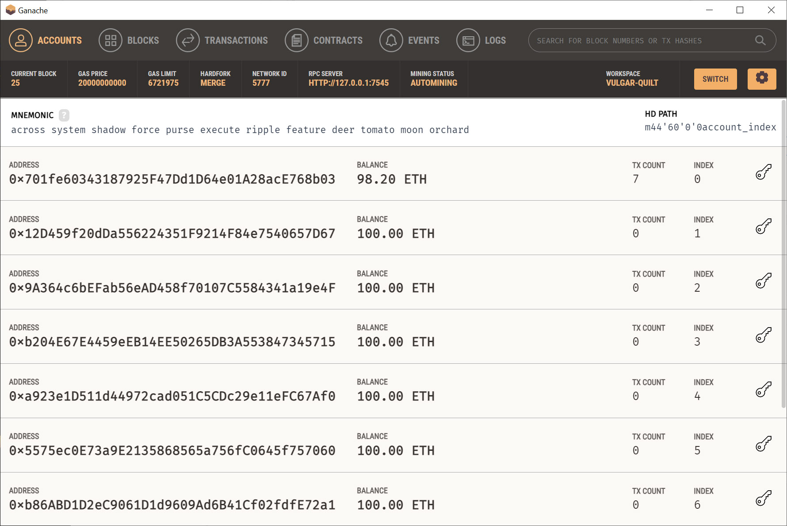
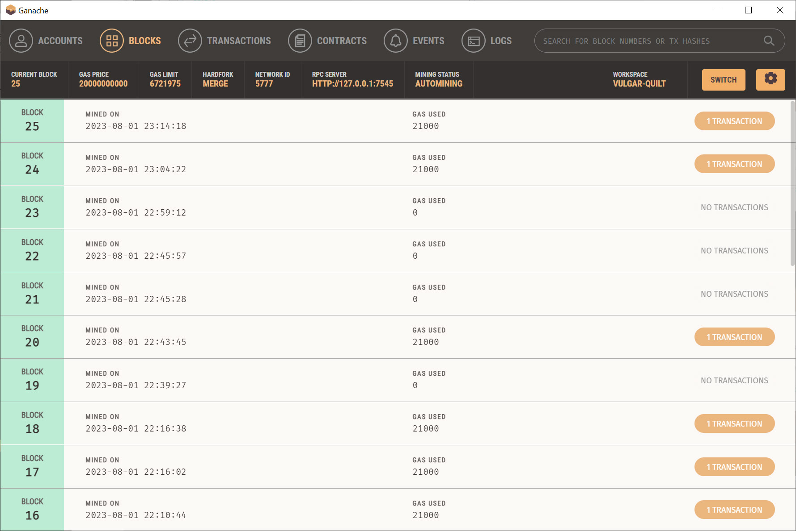
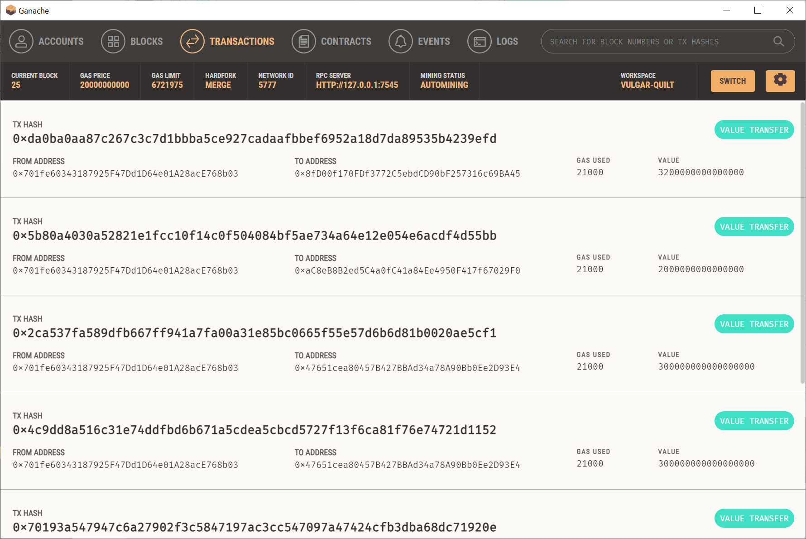
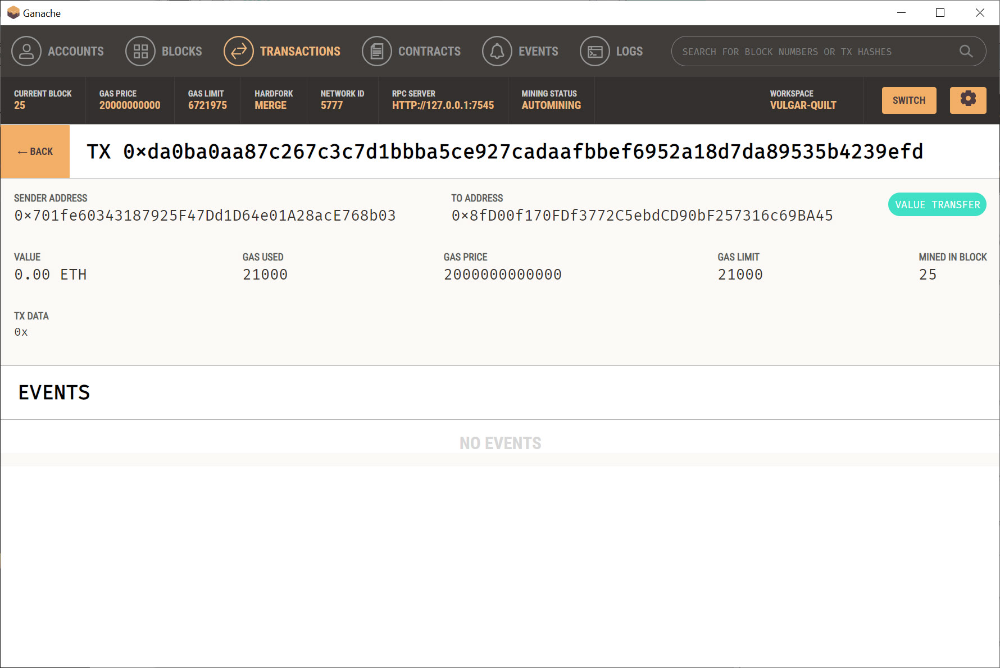

# Module-19-Challenge

FinTech Bootcamp Module 19 Challange due July 30, 2023

# Challenge - Build a Fintech Finder to hire Fintech Professionals

Build a Fintech Finder streamlit application to find fintech professionals from among a list of candidates

## Analysis

Customers want hire fintech professionals and pay using cryptocurrency.

## Purpose

Integrate the Streamlit interface with a cryptocurrency wallet and Ganache Etherurm blockchain.

## Steps

#### Import Ethereum Transaction Functions into the Fintech Finder Application

#### Sign and Execute a Ethereum Payment Transaction

#### Inspect the Ethereum Transaction

## Results

### Streamlit Application

### Streamlit Validated Transaction

### Ganache Accounts

### Ganache Blocks

### Ganache Transactions

### Ganache Verify Transaction

# github.com repository link

	https://github.com/NvPahrump/Module-19-Challenge

# Technologies

This app is designed for Python 3.7 and Streamlit 1.24.0

It uses Python 3.7.2 libraries

	typing-extensions
	python-dotenv
	streamlit
	web3==5.17
	eth-tester==0.5.0b3
	mnemonic

To build the environment

	conda create -n Module19 python==3.7.2
	conda activate Module19
	pip install typing-extensions --upgrade
	pip install python-dotenv
	pip install streamlit
	pip install web3==5.17
	pip install eth-tester==0.5.0b3
	pip install mnemonic
	pip install bip44

## Source Files:

    README.md
    
	crypto_wallet.py

	fintech_finder.py 

	.env

##  Image Files:

    Images/1.jpg
    Images/2.jpg
    Images/3.jpg
    Images/4.jpg
    Images/5.jpg
    Images/6.jpg
    
# To run

## On Windows start the Ganache app

## choose "Quickstart ereum"

## On git-bash:

	streamlit run fintech_finder.py 

# Contributors

Randy Miyazaki modified fintech_finder.py for the class assignment

# License

Intended for Randy Miyazaki and Fintech Bootcamp class personnel
